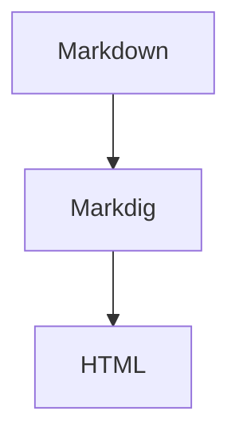

# Nanibgal Test Document

This is a paragraph with **bold**, *italic*, and a [link](https://example.com).

## Images


## Lists

### Unordered List

- First item
- Second item
- Third item

### Ordered List

1. One
2. Two
3. Three

## Blockquote

> This is a blockquote.
> It has multiple lines.

## Code

```csharp
public static void Hello()
{
    Console.WriteLine("Hello, Nanibgal!");
}
```

## Table

| Name | Type |
| --- | --- |
| Nanibgal | Project |
| Markdig | Dependency |

## Horizontal Rule

---

## Mermaid


